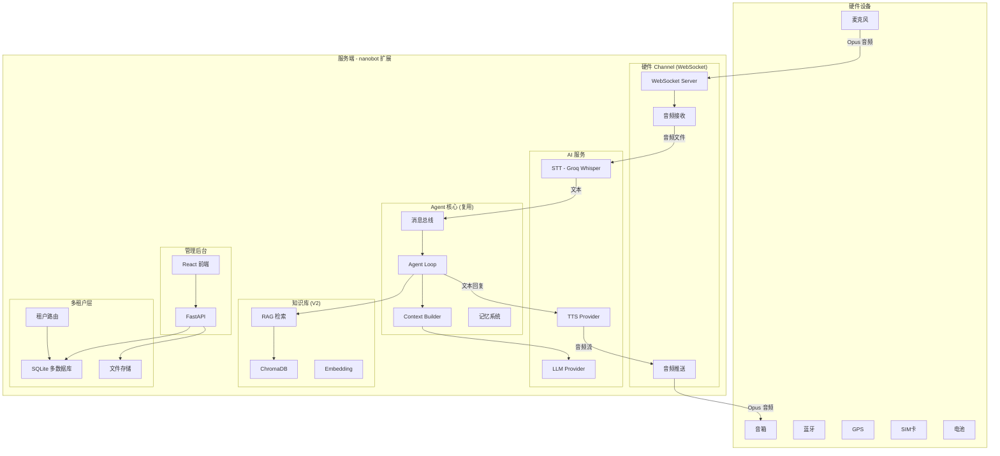

## 产品概述

基于 nanobot 框架开发一个面向儿童的智能语音聊天硬件产品的软件后端系统。小朋友通过硬件设备的麦克风说话，系统经过语音识别、AI Agent 处理、文字转语音后，通过硬件音箱播放回复。回复内容来源于家长预先上传的知识库（故事绘本、音乐等），回复音色可模拟家长声音。系统支持多家庭（多租户）使用，家长通过管理后台上传和管理内容。

## 核心功能

### V1.0 — 核心对话链路（MVP）

- 硬件 WebSocket 通信通道：设备通过 WebSocket 连接服务端，传输音频流和接收语音回复
- TTS 语音合成集成：将 Agent 文字回复转为语音（先用第三方 API）
- 基础多租户框架：SQLite 多数据库隔离，每个家庭独立数据空间
- 家长管理后台 MVP：注册登录、设备绑定、基本配置
- 完整语音对话链路：语音输入 → STT → Agent → TTS → 语音输出

### V2.0 — 知识库与内容管理

- RAG 知识库：ChromaDB 向量数据库 + Embedding 检索
- 文档解析管线：PDF/文本文件解析并向量化入库
- 音频内容管理：MP3 故事和音乐的上传、分类、播放
- 管理后台完善：文件上传、内容分类、知识库管理

### V3.0 — 音色克隆与智能交互

- 自部署 TTS 音色克隆（CosyVoice 开源模型）
- 家长音色录制采集与管理
- 智能内容推荐与播放控制

### V4.0 — 硬件量产与运营

- 嵌入式固件方案（ESP32/Linux）
- GPS 定位、SIM 卡、蓝牙配网
- 电池管理与低功耗优化
- 运营后台与多家庭管理

## 文档要求

- 所有沟通记录整理为 md 文件，作为后续决策基准
- 每个版本有详细设计文档，确定需求和方案细节后再开发
- 建立版本路线图文档

## 技术栈

### 现有复用

- **Agent 框架**：nanobot（Python 3.11+, asyncio）
- **消息总线**：asyncio.Queue 双向队列
- **STT**：Groq Whisper（已集成）
- **LLM**：20+ Provider（OpenRouter/Anthropic/DeepSeek 等）
- **构建工具**：hatchling, uv, Docker

### 新增技术

- **TTS**：
- V1: CosyVoice2 API（阿里通义实验室，免费额度，中文效果好）或 MiniMax TTS（已在 Provider 列表中）
- V3: 自部署 CosyVoice 开源模型（支持零样本音色克隆）
- **向量数据库**：ChromaDB（轻量嵌入式，Python 原生，适配 SQLite 多租户模式）
- **Embedding**：text2vec-base-chinese 或 DashScope Embedding API
- **多租户存储**：SQLite 多数据库（每租户独立 .db 文件）
- **管理后台**：FastAPI（后端 API）+ React + TypeScript + Tailwind CSS（前端）
- **硬件通信**：WebSocket（复用 nanobot 已有 websockets 依赖）
- **文档解析**：PyPDF2/pdfplumber（PDF）、mutagen（MP3 元数据）

## 实现方案

### 整体架构策略

在 nanobot 框架上扩展，不改动核心架构，通过其 Channel 插件机制、Tool 注册机制和 Provider 抽象层进行能力扩展。新增代码以独立模块形式组织，最大限度复用现有消息总线、Agent 循环、会话管理等基础设施。

### 关键技术决策

**1. 硬件 Channel — WebSocket 双向语音通道**

作为 nanobot Channel 插件实现，继承 `BaseChannel`。硬件设备通过 WebSocket 连接，上行发送 PCM/Opus 音频帧，下行接收合成语音的音频流。Channel 内部完成：

- 音频帧接收 → 本地缓存 → 调用 STT → 文本送入消息总线
- 从消息总线收到文字回复 → 调用 TTS → 音频流推送到设备

选择复用 nanobot 已有的 `websockets` 依赖而非新增框架。音频编码采用 Opus（低带宽、低延迟），回退支持 PCM。

**2. TTS Provider — 分阶段演进**

V1 阶段设计 TTS Provider 抽象层（类似现有 LLMProvider），首先对接 CosyVoice2 API：

- CosyVoice2 支持流式合成，延迟低（首包 150ms），中文效果优秀
- 支持预置音色和音色克隆，为 V3 音色克隆奠定基础
- 备选方案：MiniMax TTS API（项目已有 MiniMax Provider 配置）

抽象接口设计为 `TTSProvider.synthesize(text, voice_id) -> AsyncIterator[bytes]`，支持流式输出以降低首字节延迟。

**3. 多租户 — SQLite 多数据库 + 租户路由**

每个家庭（租户）拥有独立的：

- SQLite 数据库文件：存储用户信息、设备绑定、内容元数据、配置
- ChromaDB collection：隔离的向量检索空间
- 文件存储目录：音频、PDF 等上传文件
- nanobot workspace：独立的会话、记忆、技能

租户路由层根据设备 ID → 租户 ID 映射，在请求处理链路中注入租户上下文。

**4. RAG 知识库（V2）**

构建在 ChromaDB 之上，每个租户独立 collection：

- 文档上传 → 解析（PDF/文本）→ 分块 → Embedding → 存入 ChromaDB
- Agent 处理消息时，先进行向量检索获取相关上下文，注入 system prompt
- 通过 nanobot 的 Tool 机制注册 `knowledge_search` 工具，Agent 可主动查询知识库

## 实现注意事项

- **音频延迟控制**：TTS 必须支持流式合成，WebSocket Channel 实现分块推送，目标首字节延迟 < 500ms
- **复用现有 STT**：Groq Whisper 已集成于 `BaseChannel.transcribe_audio()`，硬件 Channel 直接复用
- **向后兼容**：所有新增代码作为独立模块，不修改 nanobot 核心文件（loop.py/runner.py 等），通过 Channel 插件、Tool 注册、Provider 扩展等机制接入
- **配置兼容**：扩展 `config.json` 的 `channels` 和 `providers` 节，遵循现有 camelCase 配置约定
- **日志规范**：复用 loguru，遵循现有日志格式，避免在音频流处理热路径中写大量日志
- **错误处理**：TTS/STT 失败时优雅降级（TTS 失败返回文字，STT 失败提示重试）

## 架构设计



## 目录结构

```
project-root/
├── docs/
│   ├── PROJECT_COMMUNICATION.md   # [NEW] 项目沟通记录文档，记录所有需求讨论和决策，作为后续开发的基准参考
│   ├── ROADMAP.md                 # [NEW] 版本路线图，描述 V1-V4 的目标、范围、时间线和依赖关系
│   └── v1/
│       └── V1_DESIGN.md           # [NEW] V1 详细设计文档，包含架构图、接口定义、数据模型、部署方案、测试计划
├── nanobot/
│   ├── channels/
│   │   └── hardware.py            # [NEW] 硬件 WebSocket Channel，继承 BaseChannel，实现音频双向传输、
│   │                              #       设备认证、心跳保活。接收 Opus 音频帧调用 STT 转文本，
│   │                              #       收到回复文本调用 TTS 转音频流推送。支持 streaming。
│   ├── providers/
│   │   └── tts.py                 # [NEW] TTS Provider 抽象层和 CosyVoice2 API 实现。
│   │                              #       定义 TTSProvider 基类（synthesize 流式接口），
│   │                              #       实现 CosyVoiceProvider 对接阿里 CosyVoice2 API，
│   │                              #       支持预置音色选择和流式音频输出。
│   ├── tenant/
│   │   ├── __init__.py            # [NEW] 多租户模块初始化
│   │   ├── models.py              # [NEW] 租户数据模型定义：Family（家庭）、Device（设备）、
│   │   │                          #       User（家长/儿童）、ContentMeta（内容元数据）。
│   │   │                          #       使用 SQLite + Pydantic 模型。
│   │   ├── manager.py             # [NEW] 租户管理器：租户 CRUD、设备绑定/解绑、
│   │   │                          #       租户路由（device_id → tenant_id）、
│   │   │                          #       SQLite 数据库生命周期管理。
│   │   └── storage.py             # [NEW] 租户文件存储：每租户独立目录，
│   │                              #       音频/PDF/配置文件的存取和路径管理。
│   └── config/
│       └── schema.py              # [MODIFY] 扩展配置 schema，新增 HardwareChannelConfig、
│                                  #          TTSProviderConfig、TenantConfig 等配置模型。
│                                  #          遵循现有 camelCase 别名 + snake_case 字段约定。
├── admin/                         # [NEW] 管理后台（独立子项目）
│   ├── backend/
│   │   ├── main.py                # [NEW] FastAPI 入口，定义 API 路由（认证、设备、内容管理）
│   │   ├── auth.py                # [NEW] JWT 认证：家长注册/登录/token 刷新
│   │   ├── devices.py             # [NEW] 设备管理 API：绑定/解绑/状态查询
│   │   └── content.py             # [NEW] 内容管理 API（V2 扩展）：文件上传/分类/删除
│   └── frontend/                  # [NEW] React 前端（V1 基础版）
│       ├── package.json
│       └── src/
│           └── App.tsx            # [NEW] 管理后台前端入口
└── tests/
    ├── channels/
    │   └── test_hardware_channel.py  # [NEW] 硬件 Channel 单元测试：WebSocket 连接、
    │                                 #       音频帧处理、设备认证、异常处理
    ├── providers/
    │   └── test_tts_provider.py      # [NEW] TTS Provider 测试：合成调用、流式输出、错误降级
    └── tenant/
        └── test_tenant_manager.py    # [NEW] 多租户测试：租户 CRUD、设备路由、数据隔离
```

## Agent Extensions

### SubAgent

- **code-explorer**
- 用途：在实现过程中深入探索 nanobot 代码库的 Channel 插件机制、Provider 注册流程、配置加载逻辑等细节，确保新增模块与现有架构完全兼容
- 预期结果：获取精确的接口签名、配置结构和注册流程，避免集成时出现不兼容问题

### Skill

- **skill-creator**
- 用途：为儿童对话场景创建专用的 nanobot Skill（如 kids-chat skill），定义儿童友好的对话规则、安全内容过滤、知识库查询模式
- 预期结果：生成符合 nanobot SKILL.md 规范的技能文件，Agent 启动时自动加载