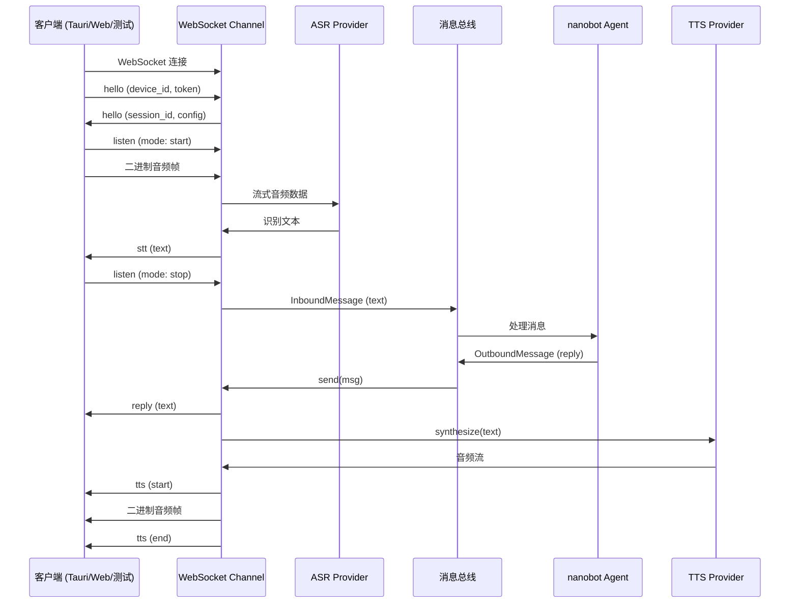
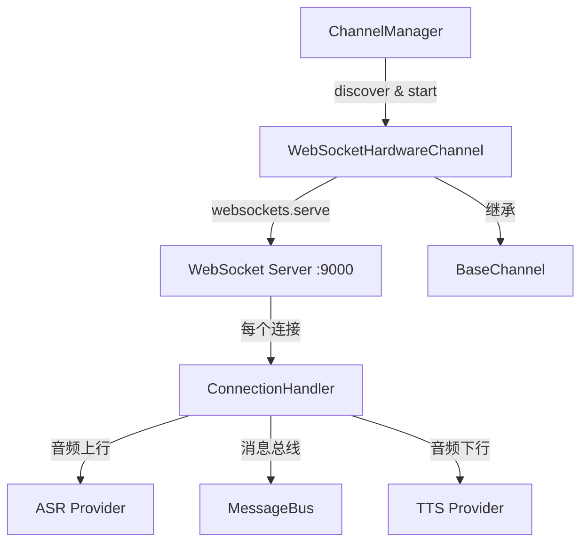

## 用户需求

参考 xiaozhi-esp32-server 的架构，新增 WebSocket Channel 作为硬件设备/桌面客户端（Tauri）的接入通道。当前项目无真实 ESP32 硬件，M4 全链路打通阶段用 WebSocket 替代 MQTT 更简洁，去掉 Mosquitto Broker 依赖。

## 产品概述

实现一个 WebSocket 语音通道，客户端通过 WebSocket 连接服务端，进行双向语音交互（语音输入 -> ASR -> Agent -> TTS -> 语音输出）。参考 xiaozhi-esp32-server 的消息协议设计，使用 JSON 文本消息做控制、二进制消息传音频。

## 核心功能

1. **WebSocket 服务器**：基于 Python websockets 库，在 nanobot gateway 启动时监听指定端口，接受客户端连接
2. **连接管理**：每个 WebSocket 连接对应独立的会话状态，包含认证、音频缓冲、ASR/TTS 状态
3. **消息协议**：JSON 文本消息（hello 握手、listen 监听控制、abort 中止、ping 心跳）+ 二进制音频帧
4. **语音处理链路**：客户端上行音频 -> ASR 识别 -> 消息总线 -> Agent -> TTS 合成 -> 下行音频
5. **Token 认证**：连接时通过 hello 消息携带 device-id 和 authorization 进行认证
6. **WebSocket 测试客户端**：替代 MQTT 测试客户端，模拟客户端进行语音对话测试

## 技术栈

- 语言：Python 3.11+，全异步 asyncio
- WebSocket 服务端：`websockets>=16.0`（pyproject.toml 中已有依赖）
- 框架集成：继承 nanobot `BaseChannel`，注册到 Channel 管理器
- ASR/TTS：复用已有的 `VolcengineASRProvider` 和 `VolcengineTTSProvider`（WebSocket 客户端）
- 配置：Pydantic BaseModel（追加 `WebSocketChannelConfig`）
- 日志：loguru
- 测试：pytest + pytest-asyncio

## 实现方案

### 整体策略

参考 xiaozhi-esp32-server 的架构，将 WebSocket 服务器内嵌到 Channel 中。Channel 的 `start()` 方法启动 WebSocket 服务监听，每个连接创建独立的 `ConnectionHandler` 管理状态和消息路由。与 MQTT Channel 的核心区别：

- **无 Broker 依赖**：WebSocket 是点对点连接，服务端直接接受客户端连接
- **协议统一**：文本消息（JSON）走控制流，二进制消息走音频流，与 ASR/TTS 的 WebSocket 协议模式一致
- **简化帧格式**：WebSocket 原生区分文本/二进制帧，不需要 MQTT 的 4 字节自定义 Header

### 消息协议设计（参考 xiaozhi-server 简化版）

**文本消息类型**（JSON，通过 `type` 字段路由）：

| type | 方向 | 说明 |
| --- | --- | --- |
| `hello` | 客户端->服务端 | 握手：携带 device_id、token、audio_params |
| `hello` | 服务端->客户端 | 握手响应：返回 session_id、配置信息 |
| `listen` | 客户端->服务端 | 开始/停止语音监听（mode: start/stop） |
| `abort` | 客户端->服务端 | 中止当前 TTS 播放 |
| `ping` | 双向 | 心跳保活 |
| `stt` | 服务端->客户端 | ASR 识别结果（中间/最终） |
| `tts` | 服务端->客户端 | TTS 状态（start/end） |
| `reply` | 服务端->客户端 | Agent 文本回复 |
| `error` | 服务端->客户端 | 错误信息 |


**二进制消息**：

- 客户端->服务端：上行音频数据（Opus/PCM），直接入 ASR 队列
- 服务端->客户端：下行 TTS 合成音频

### 关键技术决策

1. **WebSocket 服务端口独立于 Gateway HTTP 端口**：使用单独端口（默认 9000），避免与 nanobot gateway 的 HTTP 服务冲突。未来可统一为同一端口。

2. **ConnectionHandler 模式**：每个 WebSocket 连接创建独立的 Handler 实例，持有 ASR/TTS Provider 引用、音频缓冲、会话状态。连接断开时清理资源。

3. **保留 MQTT Channel**：WebSocket Channel 是新增的独立 Channel（`nanobot/channels/websocket_hw.py`），MQTT Channel 保留不动。两者可共存，未来 ESP32 硬件仍可走 MQTT。

4. **复用 BaseChannel 消息总线**：ASR 识别结果通过 `_handle_message()` 发送到消息总线，Agent 回复通过 `send()` 方法接收，与其他 Channel 完全一致。

## 实现备注

- **文件命名**：使用 `websocket_hw.py` 而非 `websocket.py`，避免与 Python 标准库或三方库命名冲突
- **性能**：音频帧直接入 ASR 流式队列，不做缓冲拼接（WebSocket 保证消息完整性，不像 MQTT 需要帧序列号）
- **超时管理**：连接超时默认 120 秒无活动自动断开，与 xiaozhi-server 一致
- **向后兼容**：MQTT Channel、mosquitto 配置、MQTT 测试客户端全部保留，不做任何修改
- **配置字段**：在 `config/schema.py` 追加 `WebSocketChannelConfig`，包含 host、port、auth_key、max_connections 等

## 架构设计

### 数据流



### 模块结构



## 目录结构

```
nanobot/
├── channels/
│   ├── websocket_hw.py      # [NEW] WebSocket 硬件语音通道。实现 WebSocket 服务器，管理客户端连接，
│   │                        #   处理 hello/listen/abort/ping 消息路由，集成 ASR/TTS 实现完整语音链路。
│   │                        #   包含 WebSocketHardwareChannel(BaseChannel) 和 ConnectionHandler 两个核心类。
│   └── hardware.py          # [保留] 原有 MQTT Channel 不修改
├── config/
│   └── schema.py            # [MODIFY] 追加 WebSocketChannelConfig 配置类（host/port/auth_key/
│                            #   max_connections/timeout 等字段），不修改已有字段
tools/
└── ws_test_client.py        # [NEW] WebSocket 测试客户端。模拟客户端连接 WebSocket 服务，支持
                             #   麦克风录音上行、TTS 音频播放、交互式命令（类似 hardware_test_client.py）
tests/
└── channels/
    └── test_websocket_hw_channel.py  # [NEW] WebSocket Channel 单元测试。覆盖连接握手、
                                      #   消息路由、认证、音频处理、超时断开、错误处理等场景
docs/
└── design/
    └── v1/
        ├── overview-and-architecture.md  # [MODIFY] 更新架构图，补充 WebSocket Channel 说明
        └── websocket-channel.md          # [NEW] WebSocket Channel 设计文档，记录协议定义、
                                          #   消息格式、认证流程、与 MQTT Channel 的对比
```

## 关键代码结构

```python
# WebSocket Channel 配置
class WebSocketChannelConfig(Base):
    """WebSocket 硬件语音通道配置"""
    enabled: bool = False
    host: str = "0.0.0.0"
    port: int = 9000
    auth_key: str = ""           # 认证密钥，为空则跳过认证
    max_connections: int = 100
    timeout_seconds: int = 120   # 无活动超时
    audio_format: str = "opus"
    allow_from: list[str] = ["*"]

# 消息类型枚举
class MessageType(str, Enum):
    HELLO = "hello"
    LISTEN = "listen"
    ABORT = "abort"
    PING = "ping"
    STT = "stt"
    TTS = "tts"
    REPLY = "reply"
    ERROR = "error"
```

## Agent Extensions

### SubAgent

- **code-explorer**
- 用途：在实现过程中探索 nanobot 框架的 Channel 注册机制、BaseChannel 接口约束、ChannelManager 的初始化流程
- 预期结果：确保 WebSocket Channel 正确集成到框架的自动发现和启动流程中