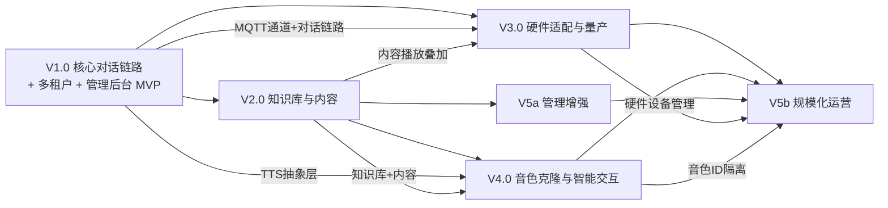

# MiniBot 语音伴侣 — 版本路线图

> 本文档描述 V1-V5 的目标、范围、里程碑和依赖关系。  
> 每个版本启动前需完成详细设计文档评审。  
> **核心原则：最小 MVP 实现 → 抓住核心问题 → 优化类往后排。**

---

## 版本全景

```
V1.0 核心对话链路 + 基础多租户 + 管理后台 MVP (MVP)
 │    ← 纯软件验证，跑通语音对话 + 设备→家庭路由 + 家长基础管理
 │    ├── V1.0a 核心对话链路（M1-M4，单租户跑通 MVP）
 │    └── V1.0b 多租户 + 管理后台（M5-M7，补全运营基础）
 │
 ├──→ V2.0 知识库与内容管理     ← 让 Agent 有知识、有内容可播放
 │     │
 │     └──→ V4.0 音色克隆与智能交互 ← 体验升级，锦上添花
 │
 ├──→ V3.0 硬件适配与量产        ← V1 对话能力就绪即可启动，不依赖 V2
 │
 └──→ V5.0 运营增强与规模化       ← 规模化运营，最后做
      ├── V5a 管理增强（仅依赖 V2，可先行）
      └── V5b 规模化运营（依赖 V3 + V4）
```

---

## V1.0 — 核心对话链路 + 基础多租户 + 管理后台 MVP

V1 拆为两个阶段，加速核心技术验证：

| 阶段 | 范围 | 目标 |
|------|------|------|
| **V1.0a** | M1-M4（MQTT + ASR/TTS + 全链路打通） | 单租户跑通语音对话 MVP，验证核心可行性 |
| **V1.0b** | M5-M7（多租户 + 管理后台 + 集成验收） | 补全多租户隔离和家长管理能力 |

### 目标

打通 **"语音输入 → STT → Agent → TTS → 语音输出"** 完整链路，实现基础多租户（设备→家庭路由）和管理后台 MVP（注册/登录/设备绑定），验证产品核心可行性。

### 范围

| 模块 | 内容 | 优先级 | 阶段 |
|------|------|--------|------|
| 硬件 MQTT Channel | MQTT 双向语音通道，设备接入层，支持 Opus/PCM 音频帧 | P0 | V1.0a |
| ASR WebSocket 客户端 | 对接火山引擎 ASR 流式识别 API | P0 | V1.0a |
| TTS WebSocket 客户端 | 对接火山引擎 TTS 流式合成 API | P0 | V1.0a |
| MQTT Broker 部署 | Mosquitto（开发）/ EMQX（生产），统一 JWT Token 认证 | P0 | V1.0a |
| 测试客户端 | 电脑端 MQTT 测试工具（Python CLI），模拟 ESP32 设备进行语音对话，支持麦克风录音/扬声器播放，遵循 §3.4 帧格式 | P0 | V1.0a |
| 多租户框架 | `aiosqlite` 多数据库（全异步），租户 CRUD，设备绑定/路由（device_id → family_id），Repository 抽象层预留 PostgreSQL 迁移路径 | P0 | V1.0b |
| 管理后台 MVP | FastAPI 后端（注册/登录/设备绑定）+ React 基础前端 | P0 | V1.0b |
| Kids-Chat Skill | 儿童友好对话规则、安全内容过滤（SKILL.md） | P1 | V1.0b |

### 技术栈新增

- `aiomqtt` — MQTT 异步设备通信（新增，优先于同步 `paho-mqtt`）
- `websockets`（已有）— 后端对接火山引擎 ASR/TTS 流式 API
- Mosquitto / EMQX — MQTT Broker（新增），**统一使用 JWT Token 认证**（确保 Mosquitto→EMQX 迁移只需换 Broker 配置，不改业务代码）
- 火山引擎 ASR WebSocket API — 语音识别（新增，V1 主选；ASRProvider 抽象层支持扩展，未来可接阿里等）
- 火山引擎 TTS WebSocket API — 语音合成（新增，V1 主选；TTSProvider 抽象层支持扩展，未来可接阿里等）
- FastAPI + JWT — 管理后台（新增）
- React + TypeScript + Tailwind CSS — 管理前端（新增）
- `aiosqlite` — 异步 SQLite 多数据库，多租户数据隔离（新增，保持全异步架构）

### 全链路延迟预算

M4 验收需满足端到端延迟指标，各分段预算如下：

| 分段 | 目标延迟 | 说明 |
|------|----------|------|
| 设备 → MQTT Broker | < 50ms | 局域网/4G 传输 |
| MQTT → ASR 识别完成 | < 500ms | 火山引擎流式 ASR |
| Agent LLM 首 token | < 800ms | 取决于 LLM 提供商 |
| TTS 首字节音频生成 | < 300ms | 火山引擎流式 TTS |
| TTS 音频 → MQTT → 设备 | < 50ms | 下行传输 |
| **合计首字节延迟** | **< 2s（验收基准）** | 理想目标 < 1.5s |
| **完整回复延迟** | **< 5s（验收基准）** | 取决于回复长度 |

> **说明**：< 2s 为 M4 验收基准线，< 1.5s 为理想优化目标。每段设独立监控指标，方便定位瓶颈。

### 里程碑

**V1.0a — 核心对话链路（单租户 MVP）**

| 里程碑 | 交付物 | 验收标准 |
|--------|--------|----------|
| M1 - 设计评审 | V1_DESIGN.md | 架构（MQTT+WebSocket双协议）、接口、数据模型评审通过 |
| M2 - MQTT 通道 + 测试客户端 | 硬件 MQTT Channel + Broker 部署 + 电脑端测试客户端 | 电脑端测试客户端通过 MQTT 发送/接收音频帧，支持麦克风录音与扬声器播放；MQTT Broker JWT 认证可用 |
| M3 - ASR/TTS | 火山引擎 ASR + TTS WebSocket 客户端 | 后端可通过 WebSocket 流式调用 ASR/TTS，ASR/TTS Provider 抽象层就绪 |
| M4 - 对话链路 | 全链路打通（单租户） | 电脑端测试客户端录音 → MQTT → ASR → Agent → TTS → MQTT → 扬声器播放语音回复；**全链路首字节延迟 < 2s，完整回复延迟 < 5s（测试环境基准）**；各分段延迟可独立监控 |

**V1.0b — 多租户 + 管理后台**

| 里程碑 | 交付物 | 验收标准 |
|--------|--------|----------|
| M5 - 多租户 | 租户框架 + `aiosqlite` 数据库隔离 + 设备路由 + Repository 抽象层 | 两个家庭数据完全隔离，设备绑定到指定家庭；全异步无阻塞 |
| M6 - 管理后台 | FastAPI 后端 + React 前端 + docker-compose 部署 | 家长可注册、登录、绑定设备、管理基础配置；管理后台可通过 docker-compose 一键启动 |
| M7 - 集成验收 | 全链路联调 + Kids-Chat | 端到端语音对话功能完整，儿童友好对话，多租户隔离验证通过 |

### 测试客户端说明

电脑端 MQTT 测试客户端（`tools/hardware_test_client.py`）模拟 ESP32 硬件设备的行为：

- **技术**：Python CLI 应用，基于 `aiomqtt` + `sounddevice`（或 `pyaudio`）
- **协议兼容**：遵循 §3.4 MQTT 帧格式（4 字节 Header + Audio Data），与未来真实硬件完全一致
- **能力**：麦克风录音（PCM 16kHz 16bit）→ Opus 编码（可选）→ MQTT 上行；MQTT 下行 → Opus 解码 → 扬声器播放
- **与真实硬件的差异**：无电池管理、无蓝牙配网、无 GPIO，仅验证音频通信和对话链路

### 依赖

- nanobot 框架稳定运行
- MQTT Broker（Mosquitto / EMQX）可用
- 火山引擎 ASR/TTS WebSocket API 可用
- ASR/TTS Provider 抽象层保留扩展性（ASR/TTS 未来可接阿里等厂商）

---

## V2.0 — 知识库与内容管理

### 目标

家长上传的资料（PDF、文本、音频）能被 Agent 检索和引用，实现**基于知识库的智能回复和音频播放**。

### 范围

| 模块 | 内容 | 优先级 |
|------|------|--------|
| VectorStore 抽象层 | `VectorStoreProvider` 抽象基类，V2 实现 ChromaDB，预留切换 Milvus 能力 | P0 |
| RAG 知识库 | ChromaDB + Embedding，每租户独立 collection | P0 |
| 文档解析 | PDF → 文本 → 分块 → 向量化入库 | P0 |
| knowledge_search Tool | Agent 可主动查询知识库的 nanobot Tool | P0 |
| 音频内容管理 | MP3 上传、分类、元数据提取（mutagen） | P0 |
| 播放指令 | Agent 识别播放意图，下发播放指令到硬件 | P1 |
| 测试客户端升级 | 支持知识库内容播放测试 | P1 |

### 技术栈新增

- ChromaDB — 向量数据库（通过 VectorStoreProvider 抽象，可切换 Milvus）
- text2vec-base-chinese / DashScope Embedding — 文本嵌入
- PyPDF2 / pdfplumber — PDF 解析
- mutagen — MP3 元数据

### 里程碑

| 里程碑 | 交付物 | 验收标准 |
|--------|--------|----------|
| M1 - 设计评审 | V2_DESIGN.md | RAG 架构（含 VectorStoreProvider 抽象层）、解析管线、播放协议评审通过 |
| M2 - RAG 管线 | VectorStoreProvider + ChromaDB 实现 + Embedding + 文档解析 | 上传 PDF → Agent 能引用其中内容回答；VectorStore 可切换 |
| M3 - 音频管理 | 上传/分类/播放指令 | 家长上传故事 MP3 → 小朋友说"讲个故事" → 播放 |

### 依赖

- V1.0 完成（对话链路）

---

## V3.0 — 硬件适配与量产

### 目标

完成**硬件选型、固件开发和量产适配**，让产品从"电脑端测试客户端"走向真实硬件设备。

### 范围

| 模块 | 内容 | 优先级 |
|------|------|--------|
| 硬件方案选型 | ESP32 vs Linux 方案评估与确定 | P0 |
| 嵌入式固件 | 语音采集、MQTT 通信、音频播放 | P0 |
| 硬件通信适配 | WiFi/4G 双模联网，断线重连 | P0 |
| 蓝牙配网 | 手机扫码配网（最小可用） | P0 |
| OTA 空中升级 | A/B 双分区固件布局、安全 OTA 升级通道、固件签名验证、断点续传、失败自动回滚 | P0 |
| 电池管理 | 低功耗优化，续航监控 | P1 |
| GPS 定位 | 儿童位置上报，家长端查看 | P1 |
| SIM 卡管理 | 4G 联网，流量管理 | P1 |
| 量产适配 | 生产固件、烧录流程、配网流程 | P1 |

### 技术栈新增

- ESP-IDF / Buildroot（嵌入式）
- 4G 模组 SDK
- BLE 配网协议
- ESP-IDF OTA 组件 / MCUboot — A/B 分区 OTA 升级框架
- 固件签名工具链（ECDSA）— 固件完整性与合法性验证

### 里程碑

| 里程碑 | 交付物 | 验收标准 |
|--------|--------|----------|
| M1 - 硬件选型 | V3_DESIGN.md | 硬件方案评审通过（ESP32 vs Linux） |
| M2 - 固件原型 | 开发板固件 | 开发板语音对话端到端可用（替代电脑测试客户端），音频格式支持 PCM 16kHz 16bit（必须） + Opus（推荐） |
| M3 - 联网/配网 | WiFi + 蓝牙配网 | 手机扫码配网，设备稳定联网 |
| M4 - OTA 升级 | A/B 分区 Bootloader + OTA 服务端 + 固件签名 | 设备可通过网络安全升级固件，升级失败自动回滚，支持断点续传 |
| M5 - 量产适配 | 生产固件 + 完整配网流程 | 量产流程打通 |

### 依赖

- **V1.0 完成**（核心对话链路就绪，硬件固件只需 MQTT + 音频采集/播放能力）
- V2.0 的内容播放能力可在固件上叠加，不阻塞硬件启动
- 硬件 ID 和供应商确定
- 结构设计和模具
- 硬件选型需保证 Flash ≥ 4MB（支持 A/B 双分区 OTA）

> **说明**：V3 的核心依赖是 V1（MQTT 通道 + 对话链路），不需要等 V2 知识库完成。硬件选型（M1）和固件原型（M2）只需 MQTT 通信和音频采集/播放能力。V2 的内容播放指令可在 V3 固件就绪后叠加支持。

---

## V4.0 — 音色克隆与智能交互

### 目标

实现**家长音色克隆**，让 AI 用家长的声音和孩子聊天。提升交互智能度。属于**体验升级**，非核心链路。

> **关键决策**：音色克隆**不自部署模型**，统一使用云厂商（火山引擎 / 阿里等）的音色克隆 API，与 V1 ASR/TTS 保持一致的"云 API 优先"策略，避免 GPU 推理的运维和成本负担。

### 范围

| 模块 | 内容 | 优先级 |
|------|------|--------|
| 音色克隆 API 对接 | 对接云厂商音色克隆 API（火山引擎 / 阿里等），零样本/少样本克隆，3-10s 参考音频 | P0 |
| 音色管理 | 家长录制参考音频，音色训练/预览，按租户隔离音色 | P0 |
| TTSProvider 扩展 | 在已有 TTSProvider 抽象层上新增音色克隆 Provider，复用 V1 TTS 流式架构 | P0 |
| 智能推荐 | 根据对话习惯推荐故事/音乐 | P1 |
| 播放控制增强 | 暂停、继续、切换、音量调节 | P1 |

### 技术栈新增

- 云厂商音色克隆 API（火山引擎定制化音色 / 阿里 CosyVoice API 等，通过 TTSProvider 抽象层接入）
- 音色元数据存储（参考音频、训练状态、voice_id 映射）

### 云厂商音色克隆 API 选型

> ⚠️ V4 启动前需完成 API 选型评估：

| 评估维度 | 说明 |
|----------|------|
| 克隆效果 | 3-10s 参考音频的还原度，中文儿童场景适配 |
| 训练/注册耗时 | 上传参考音频到音色可用的等待时间 |
| 合成延迟 | 使用克隆音色的流式 TTS 首字节延迟（目标 < 1s） |
| 按量计费成本 | 对比自部署 GPU 方案的总拥有成本（TCO） |
| API 稳定性 | SLA、QPS 限制、服务可用性 |
| 与 V1 TTS 架构兼容性 | 是否可复用 TTSProvider + WebSocket 流式架构 |

### 里程碑

| 里程碑 | 交付物 | 验收标准 |
|--------|--------|----------|
| M1 - 设计评审 | V4_DESIGN.md | 音色克隆 API 选型报告 + 方案评审通过 |
| M2 - API 对接 | 音色克隆 TTSProvider 实现 | 上传参考音频 → 注册音色 → 使用克隆音色流式 TTS 合成；延迟 < 1s |
| M3 - 音色管理 | 家长录音 → 克隆音色 + 管理后台 | 上传 10s 音频 → AI 用家长声音回复；家长可在后台管理/预览/切换音色 |
| M4 - 智能交互 | 推荐 + 播放控制增强 | 语音控制播放，个性化推荐 |

### 依赖

- V2.0 完成（知识库 + 内容管理）
- V1.0 的 TTSProvider 抽象层（复用流式 TTS 架构）
- 云厂商音色克隆 API 可用（火山引擎 / 阿里等）

---

## V5.0 — 运营增强与规模化

V5 拆分为两个阶段，缩短关键路径，允许管理增强在硬件完成前先行启动。

### V5a — 管理增强（仅依赖 V2）

#### 目标

增强管理后台功能，支持**内容管理增强**、**多设备管理**和**使用统计**。V1 已有基础管理后台 + 多租户，V5a 在 V2 知识库就绪后即可启动，**不依赖硬件和音色克隆**。

#### 范围

| 模块 | 内容 | 优先级 |
|------|------|--------|
| 内容管理增强 | 知识库内容可视化管理、文档上传/分类/搜索 | P0 |
| 设备管理增强 | 设备绑定/解绑/转移，多设备支持 | P0 |
| 使用统计 | 对话次数、使用时长、活跃度统计 | P1 |
| 家庭管理增强 | 成员管理、权限控制 | P1 |

#### 里程碑

| 里程碑 | 交付物 | 验收标准 |
|--------|--------|----------|
| M1 - 设计评审 | V5a_DESIGN.md | 管理增强方案评审通过 |
| M2 - 内容管理 | 可视化内容管理 | 家长可通过后台管理知识库内容、上传/删除/搜索 |
| M3 - 运营基础 | 使用统计 + 设备管理增强 | 多设备管理、基础使用统计可用 |

#### 依赖

- V2.0 完成（知识库 + 内容管理）
- V1.0 管理后台 MVP 和多租户框架

### V5b — 规模化运营（依赖 V3 + V4）

#### 目标

实现**计费系统**、**移动端 App**和**音色模型管理**，支撑商业化运营和规模化使用。

#### 范围

| 模块 | 内容 | 优先级 |
|------|------|--------|
| 音色管理增强 | 按租户隔离云端音色 ID，管理后台音色预览/切换 | P0 |
| 运营后台 | 多家庭管理、高级统计、运营面板 | P0 |
| 计费系统 | 租户用量统计，配额管理，付费 | P1 |
| 移动端 App | 家长手机端（配网 + 管理 + 远程控制） | P2 |

#### 技术栈新增

- React Native / Flutter（移动端 App）

#### 里程碑

| 里程碑 | 交付物 | 验收标准 |
|--------|--------|----------|
| M1 - 设计评审 | V5b_DESIGN.md | 规模化运营方案评审通过 |
| M2 - 音色管理 | 云端音色 ID 按租户隔离 + 后台管理 | 家长可在后台管理自己的克隆音色 |
| M3 - 运营能力 | 运营后台 + 计费基础 | 多家庭管理、用量统计、配额管理可用 |
| M4 - 移动端 | App 基础版 | 家长手机端配网、远程设备管理 |

#### 依赖

- V3.0 完成（硬件量产，设备管理需要真实硬件）
- V4.0 完成（音色克隆，云端音色需按租户隔离）
- V5a 完成（管理增强基础）

---

## 跨版本依赖关系



> **说明**：
> - **V3（硬件）在 V1 之后即可启动**，不需要等 V2 知识库。硬件固件只需 MQTT 通道和对话链路，V2 的内容播放可后续叠加。
> - **V4（音色克隆）依赖 V2**，因为音色管理需要内容管理基础。
> - V5a（管理增强）仅依赖 V2，可与 V3/V4 并行；V5b（规模化运营）等 V3+V4+V5a 完成后再做。

## 风险与应对

| # | 风险 | 影响 | 应对策略 |
|---|------|------|----------|
| R1 | 火山引擎 ASR/TTS API 限制/变更 | V1 语音链路不可用 | ASR/TTS 抽象层支持扩展其他厂商（阿里等）；Provider 接口统一可快速切换 |
| R2 | MQTT Broker 性能瓶颈 | 设备接入受限 | V1 用 Mosquitto 验证，生产切 EMQX 支撑百万连接；V1 即统一 JWT 认证，确保迁移零改动 |
| R3 | 音频延迟过高（全链路 MQTT→ASR→Agent→TTS→MQTT） | 用户体验差 | 流式合成 + Opus 压缩；验收基准：首字节 < 2s，理想目标 < 1.5s；各分段独立监控（见延迟预算表） |
| R4 | ChromaDB 性能瓶颈 | V2 知识库检索慢 | V2 实现 `VectorStoreProvider` 抽象层，ChromaDB 为默认实现，可切换 Milvus |
| R5 | 硬件选型与供应链风险 | V3 延期 | V1-V2 用电脑端测试客户端验证全部软件功能，硬件设计可并行推进 |
| R6 | 嵌入式开发周期长 | V3 延期 | 开发板先行验证，量产适配后置 |
| R7 | OTA 升级失败导致设备变砖 | 设备不可用 | A/B 双分区 + 看门狗回滚机制，固件签名校验防篡改，升级前校验电量 ≥ 30% |
| R8 | 音色克隆效果不佳 | V4 核心卖点受损 | 多厂商 API 对比（火山引擎/阿里 CosyVoice API 等）；TTSProvider 抽象层支持快速切换 |
| R9 | MQTT 弱网场景音频丢帧 | 语音质量受损 | QoS 策略可调（0→1），端侧缓冲+插值补偿 |
| R10 | SQLite 写锁并发瓶颈 | 多设备同时对话争抢锁 | 使用 `aiosqlite` 保持全异步；设计 Repository 抽象层，V5b 规模化时可迁移 PostgreSQL |
| R11 | 云厂商音色克隆 API 定价/限制 | V4 运营成本过高或功能受限 | 多厂商对比评估（火山引擎/阿里等）；TTSProvider 抽象层支持切换；按量计费可控成本 |

---

*文档维护人：项目团队*  
*最后更新：2026-03-27*
