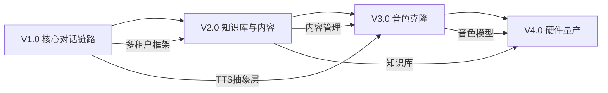

# MiniBot 语音伴侣 — 版本路线图

> 本文档描述 V1-V4 的目标、范围、里程碑和依赖关系。  
> 每个版本启动前需完成详细设计文档评审。

---

## 版本全景

```
V1.0 核心对话链路 (MVP)
 │
 ├──→ V2.0 知识库与内容管理
 │     │
 │     └──→ V3.0 音色克隆与智能交互
 │           │
 │           └──→ V4.0 硬件量产与运营
 │
 └── 各版本可并行推进文档和设计
```

---

## V1.0 — 核心对话链路（MVP）

### 目标

打通 **"语音输入 → STT → Agent → TTS → 语音输出"** 完整链路，验证产品核心可行性。

### 范围

| 模块 | 内容 | 优先级 |
|------|------|--------|
| 硬件 MQTT Channel | MQTT 双向语音通道，设备接入层，支持 Opus/PCM 音频帧 | P0 |
| ASR WebSocket 客户端 | 对接火山引擎 ASR 流式识别 API | P0 |
| TTS WebSocket 客户端 | 对接火山引擎 TTS 流式合成 API | P0 |
| MQTT Broker 部署 | Mosquitto（开发）/ EMQX（生产） | P0 |
| 多租户框架 | SQLite 多数据库，租户 CRUD，设备绑定/路由 | P0 |
| 管理后台 MVP | FastAPI 后端：注册/登录/设备绑定 | P1 |
| 管理前端 MVP | React 基础页面：登录、设备管理 | P1 |
| 测试客户端 | 模拟 ESP32 的 MQTT 测试工具 | P1 |
| Kids-Chat Skill | 儿童友好对话规则、安全内容过滤 | P2 |

### 技术栈新增

- `aiomqtt` / `paho-mqtt` — MQTT 设备通信（新增）
- `websockets`（已有）— 后端对接火山引擎 ASR/TTS 流式 API
- Mosquitto / EMQX — MQTT Broker（新增）
- 火山引擎 ASR WebSocket API — 语音识别（新增，V1 主选；ASRProvider 抽象层支持扩展，未来可接阿里等）
- 火山引擎 TTS WebSocket API — 语音合成（新增，V1 主选；TTSProvider 抽象层支持扩展）
- SQLite — 多租户存储
- FastAPI + JWT — 管理后台
- React + TypeScript + Tailwind CSS — 管理前端

### 里程碑

| 里程碑 | 交付物 | 验收标准 |
|--------|--------|----------|
| M1 - 设计评审 | V1_DESIGN.md | 架构（MQTT+WebSocket双协议）、接口、数据模型评审通过 |
| M2 - MQTT 通道 | 硬件 MQTT Channel + Broker 部署 | 测试客户端通过 MQTT 发送音频帧到后端 |
| M3 - ASR/TTS | 火山引擎 ASR + TTS WebSocket 客户端 | 后端可通过 WebSocket 流式调用 ASR/TTS |
| M4 - 对话链路 | 全链路打通 | 测试客户端 MQTT 发语音 → ASR → Agent → TTS → MQTT 收到语音回复 |
| M5 - 多租户 | 租户模块 + 设备绑定 | 两个设备绑定不同家庭，数据隔离 |
| M6 - 管理后台 | 后端 API + 前端页面 | 家长可注册、登录、绑定设备 |
| M7 - 集成验收 | 全链路联调 | 端到端语音对话 + 后台管理功能完整 |

### 不包含

- 知识库/RAG（V2）
- 音色克隆（V3）
- 硬件固件开发（V4）
- 移动端 App
- GPS 定位/SIM 卡功能

### 依赖

- nanobot 框架稳定运行
- MQTT Broker（Mosquitto / EMQX）可用
- 火山引擎 ASR/TTS WebSocket API 可用
- ASR/TTS Provider 抽象层保留扩展性（Groq Whisper 可作 ASR 降级方案）

---

## V2.0 — 知识库与内容管理

### 目标

家长上传的资料（PDF、文本、音频）能被 Agent 检索和引用，实现**基于知识库的智能回复和音频播放**。

### 范围

| 模块 | 内容 | 优先级 |
|------|------|--------|
| RAG 知识库 | ChromaDB + Embedding，每租户独立 collection | P0 |
| 文档解析 | PDF → 文本 → 分块 → 向量化入库 | P0 |
| knowledge_search Tool | Agent 可主动查询知识库的 nanobot Tool | P0 |
| 音频内容管理 | MP3 上传、分类、元数据提取（mutagen） | P0 |
| 播放指令 | Agent 识别播放意图，下发播放指令到硬件 | P1 |
| 管理后台 - 内容管理 | 文件上传、分类管理、知识库状态 | P1 |

### 技术栈新增

- ChromaDB — 向量数据库
- text2vec-base-chinese / DashScope Embedding — 文本嵌入
- PyPDF2 / pdfplumber — PDF 解析
- mutagen — MP3 元数据

### 里程碑

| 里程碑 | 交付物 | 验收标准 |
|--------|--------|----------|
| M1 - 设计评审 | V2_DESIGN.md | RAG 架构、解析管线、播放协议评审通过 |
| M2 - RAG 管线 | ChromaDB + Embedding + 文档解析 | 上传 PDF → Agent 能引用其中内容回答 |
| M3 - 音频管理 | 上传/分类/播放指令 | 家长上传故事 MP3 → 小朋友说"讲个故事" → 播放 |
| M4 - 后台完善 | 内容管理页面 | 家长可上传/删除/分类文件 |

### 依赖

- V1.0 完成（对话链路 + 多租户 + 管理后台）

---

## V3.0 — 音色克隆与智能交互

### 目标

实现**家长音色克隆**，让 AI 用家长的声音和孩子聊天。提升交互智能度。

### 范围

| 模块 | 内容 | 优先级 |
|------|------|--------|
| 自部署 TTS | CosyVoice 开源模型部署，替代 API | P0 |
| 音色克隆 | 零样本/少样本音色克隆，3-10s 参考音频 | P0 |
| 音色管理 | 家长录制参考音频，音色训练/预览 | P0 |
| 智能推荐 | 根据对话习惯推荐故事/音乐 | P1 |
| 播放控制 | 暂停、继续、切换、音量调节 | P1 |

### 技术栈新增

- CosyVoice 开源模型（GPU 推理）
- 音色特征提取与存储

### 里程碑

| 里程碑 | 交付物 | 验收标准 |
|--------|--------|----------|
| M1 - 设计评审 | V3_DESIGN.md | 音色克隆方案、模型部署方案评审通过 |
| M2 - 模型部署 | CosyVoice 服务 | 本地推理可用，延迟 < 1s |
| M3 - 音色克隆 | 家长录音 → 克隆音色 | 上传 10s 音频 → AI 用家长声音回复 |
| M4 - 智能交互 | 推荐 + 播放控制 | 语音控制播放，个性化推荐 |

### 依赖

- V2.0 完成（知识库 + 内容管理）
- GPU 服务器（CosyVoice 推理）

---

## V4.0 — 硬件量产与运营

### 目标

完成**硬件适配**和**运营能力**建设，支撑产品量产和多家庭规模化使用。

### 范围

| 模块 | 内容 | 优先级 |
|------|------|--------|
| 嵌入式固件 | ESP32 或 Linux 方案选型与实现 | P0 |
| 硬件通信适配 | WiFi/4G 双模联网，断线重连 | P0 |
| GPS 定位 | 儿童位置上报，家长端查看 | P1 |
| SIM 卡管理 | 4G 联网，流量管理 | P1 |
| 蓝牙配网 | 手机 App 扫码配网 | P1 |
| 电池管理 | 低功耗优化，续航监控 | P1 |
| 运营后台 | 多家庭管理、使用统计、计费 | P2 |
| 移动端 App | 家长手机端（配网 + 管理） | P2 |

### 技术栈新增

- ESP-IDF / Buildroot（嵌入式）
- React Native / Flutter（移动端 App）
- 4G 模组 SDK

### 里程碑

| 里程碑 | 交付物 | 验收标准 |
|--------|--------|----------|
| M1 - 硬件选型 | V4_DESIGN.md | 硬件方案评审通过（ESP32 vs Linux） |
| M2 - 固件原型 | 开发板固件 | 开发板语音对话端到端可用 |
| M3 - 定位/联网 | GPS + SIM | 家长端可查看儿童位置 |
| M4 - 量产适配 | 生产固件 + 配网 | 量产流程打通 |

### 依赖

- V3.0 完成（音色克隆 + 智能交互）
- 硬件 ID 和供应商确定
- 结构设计和模具

---

## 跨版本依赖关系



## 风险与应对

| 风险 | 影响 | 应对策略 |
|------|------|----------|
| 火山引擎 ASR/TTS API 限制/变更 | V1 语音链路不可用 | ASR 可降级 Groq Whisper（框架已有），TTS 抽象层支持扩展其他厂商；ASR/TTS Provider 接口统一可快速切换 |
| MQTT Broker 性能瓶颈 | 设备接入受限 | V1 用 Mosquitto 验证，生产切 EMQX 支撑百万连接 |
| 音频延迟过高（MQTT→ASR→Agent→TTS→MQTT 全链路） | 用户体验差 | 流式合成 + Opus 压缩，目标全链路首字节 < 1s |
| ChromaDB 性能瓶颈 | V2 知识库检索慢 | 预留切换 Milvus 的接口抽象 |
| 音色克隆效果不佳 | V3 核心卖点受损 | 多模型对比（CosyVoice/GPT-SoVITS/Fish-Speech） |
| 嵌入式开发周期长 | V4 延期 | V1-V3 用 MQTT 测试客户端验证，硬件并行推进 |
| MQTT 弱网场景音频丢帧 | 语音质量受损 | QoS 策略可调（0→1），端侧缓冲+插值补偿 |

---

*文档维护人：项目团队*  
*最后更新：2026-03-27*
